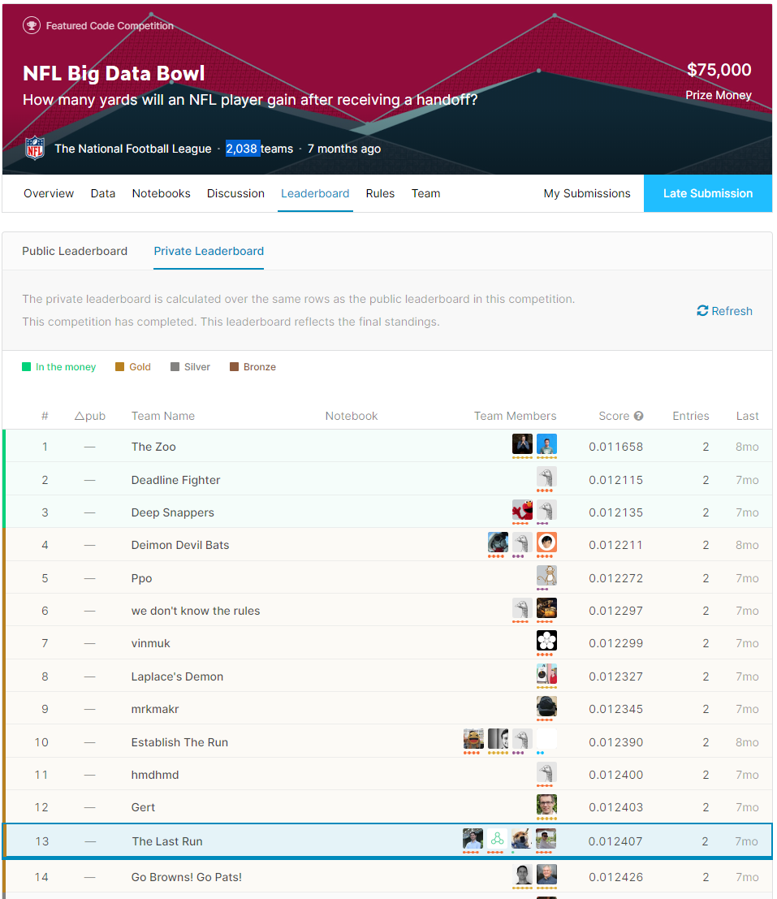

# 13th place solution to NFL Big Data Bowl Competition in Kaggle

NFL Big Data Bowl competition finalized on 6th January 2020 with 2,038 teams. 

National Football League (NFL) arranged a Kaggle competition to develop a model to predict how many yards a team will gain on given rushing plays as they happen. We're provided game, play, and player-level data, including the position and speed of players as provided in the NFL’s Next Gen Stats data. And the best part - we could see how our model performed, as the leaderboard were updated week after week on the current season’s game data as it played out.

Thanks to Kaggle team, organizers, Kaggle community for their contributions and my brilliant teammates [Pocket](https://www.kaggle.com/pocketsuteado), [TripleLift](https://www.kaggle.com/triplelift) and [Sunyuhao](https://www.kaggle.com/sunyuhao222) for their efforts. It was real fun to work with them.

This is the brief summary of our final pipeline with the code for each step. Please visit the competition page for competition data and more details;
https://www.kaggle.com/c/nfl-big-data-bowl-2020

We developed a Deep Learning model consisting of Attention and Embedding layers on top of a Multilayer Perceptron.

Few words about how we came up with the model structure. To simplify we assume a rushing play consists of:

- A rusher, whose aim is to run forward as far as possible
- 11 defense players who are trying to stop the rusher
- 10 remaining offense players trying to prevent defenders from blocking or tackling the rusher

Embedding layers were used to represent player’s basic features (speed, direction and orientation) and their projections by other players. After, the projections of the features by teammates and rival team players were summed up, which brought symmetry for everyone.

For Data Augmentation; spatial features like coordinates were flipped with respect to X axis.

We blended 2 different MLP models and one Lightgbm model as you can see on "triple-blend-augmentation.ipynb" notebook, but, single model described above gave us best results on final leaderboard, which is implemented on "single-triple-augmentation.ipynb" notebook.

I hope you find it useful what we've done, which is open to play with.

Hope to see you in the upcoming competitions,

Emin
